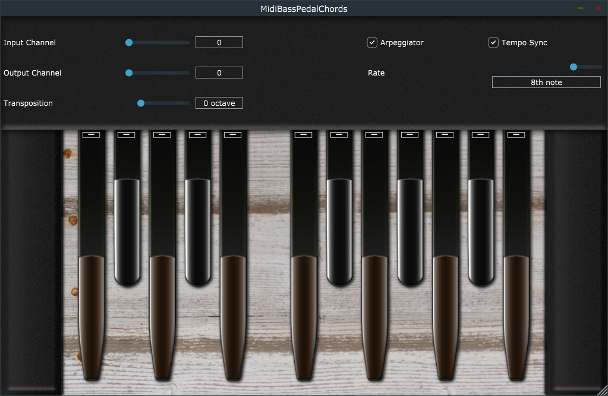
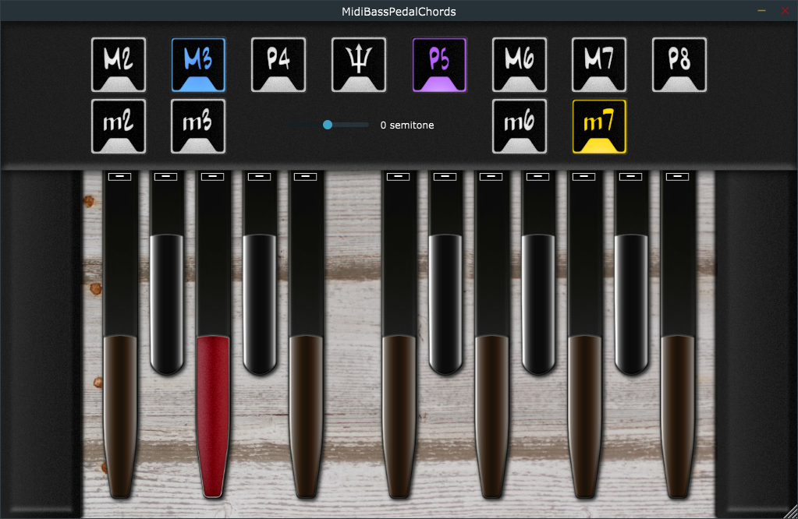

# Midi Bass Pedal Chords
A VST3 plugin developed with JUCE framework to map chords to a MIDI bass pedal (or any MIDI controller)

## General purpose
The idea is to use my MIDI bass pedal (Roland PK5-A) and expand its usage by mapping a root note and chord to each note of the octave. 
This way I can build a sequence of chords to play with my feet while improvising on any other instrument.


It was mainly a way to start learning how to use the JUCE framework and make an application I can use instead of a dull tutorial. 
I'll improve it as ideas come and I make progress learning the framework. 


It was built using version 6.0.5 of JUCE on Windows 10 with Visual Studio 2019 (generated by Projucer) and with CMake in Visual Studio Code, I didn't try other IDEs or operating systems.

You're welcome to clone it and use it as you want. And if you see stupid code, don't hesitate to tell me, I'll be happy to improve and fix it :) 

## Build

### Projucer ###
The project is compatible with the projucer so you can just open it and export to your favorite compatible IDE.

### CMake ###

To build the project using CMake, use the command line

```bash
# Generate
cmake . -B build
# Build
cmake --build build # --config Release
```

If you want the plugin to be copied in your VST3 folder, change COPY_PLUGIN_AFTER_BUILD to TRUE in Source/CMakeLists.txt

If you don't need JUCE extras (I use AudioPluginHost for debugging in Visual Studio Code), pass the JUCE_BUILD_EXTRAS option to OFF in the root CMakeLists.txt

For a great guide about configuring a CMake project with Visual Studio Code, I advise you to check [this great repository](https://github.com/tomoyanonymous/juce_cmake_vscode_example).

## Features

The interface is a work in progress. I made the layout and now am working on the look and feel part to make a better design. The features are fully functional.




* **Input Midi Channel** : Defines from which channel the incoming MIDI events will be processed
* **Output Midi Channel** : Defines to which channel the processed MIDI events will be routed
* **Octave Transpose** : If a value other than 0 is selected, the root note will be played at its original height and the selected chord will be transposed to the chosen octave
* **Arpeggiator** : Self explanatory :)



When you click on a note, you have access to the intervals panel.

There you can select which intervals will be played for the selected note. You can also decide to transpose the whole chord by a number of semitones. To close the panel, click again on the note.


And that's it, it's pretty straight forward.


## Next

Some ideas I have in mind to improve it :
 * Design (obviously)
 * Shortcuts to add some intervals to all notes
 * Presets to quickly change configuration
 * More intervals eventually (jazz chords all the way!)